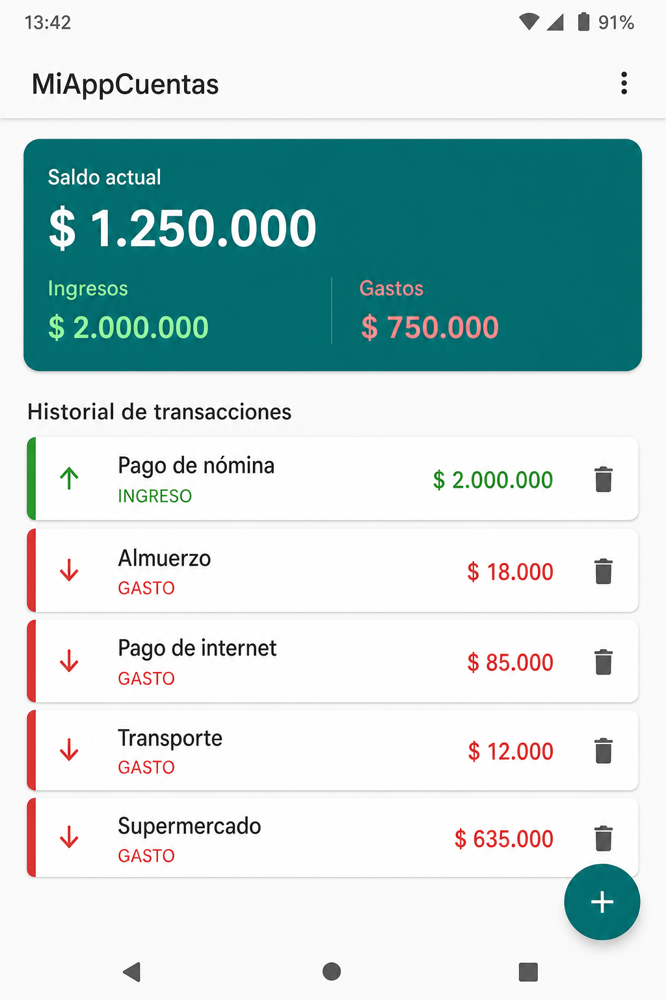
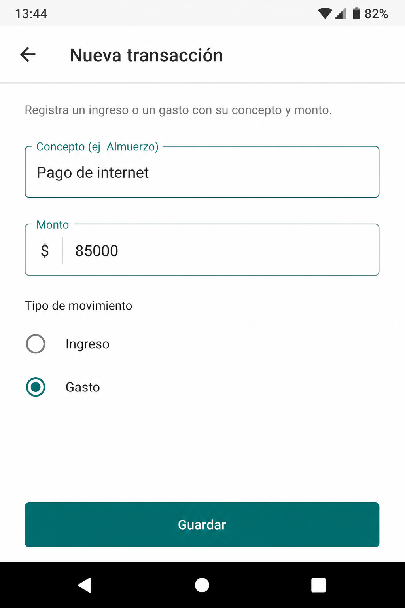

# miappcuentas2

**Estudiante:** Sebastián *(completa tu nombre completo aquí)*

Aplicación nativa de Android para el registro de finanzas personales (Momento 2). Los ingresos y gastos se sincronizan en **tiempo real** con **Firebase Firestore**, para que varios teléfonos vean los mismos datos.

## Funcionalidades

- CRUD completo en la colección `transacciones` de Firestore.
- Lista con `RecyclerView` y `SnapshotListener` (se actualiza sola).
- Editar y eliminar usando el **Document ID**.
- Formularios con `TextInputLayout` y validaciones en tiempo real (`TextWatcher`).
- El botón Guardar se deshabilita mientras se envía, para evitar doble registro.
- El listener de Firebase se libera en `onDestroy()` con `ListenerRegistration.remove()`.

## Cómo conectar Firebase (obligatorio)

1. Entra a [Firebase Console](https://console.firebase.google.com/).
2. Crea un proyecto, por ejemplo `MiAppCuentas`.
3. Agrega una app Android con el paquete `com.example.miappcuentas`.
4. Descarga `google-services.json` y colócalo en:
   `app/google-services.json`
5. En Firebase: **Build → Firestore Database → Create database**.
6. Usa modo de prueba o estas reglas:

```
rules_version = '2';
service cloud.firestore {
  match /databases/{database}/documents {
    match /transacciones/{documento} {
      allow read, write: if true;
    }
  }
}
```

7. Abre el proyecto en Android Studio, sincroniza Gradle y pulsa Run.
8. El emulador o el celular deben tener internet.

## Capturas de pantalla

### Lista de transacciones



### Formulario de registro



## Estructura del código

```
app/src/main/java/com/example/miappcuentas/
├── modelo/Transaccion.java          POJO de Firestore
├── datos/TransaccionRepositorio.java  CRUD + SnapshotListener
├── ui/TransaccionAdapter.java
├── MainActivity.java
├── FormularioActivity.java
└── AjustesActivity.java
```
